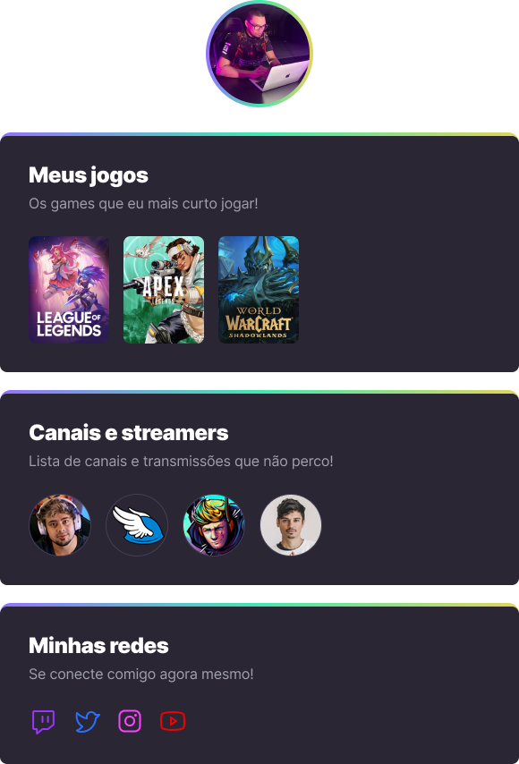
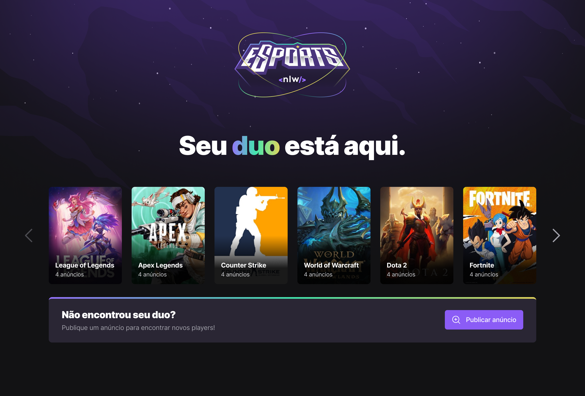
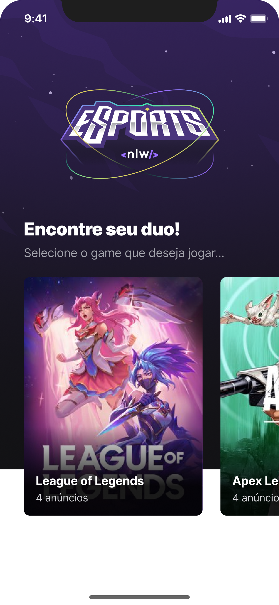

# Next Level Week eSports  
This is an online event promoted by Rocketseat, a Brazilian coding school. It's the 10th edition of this hands-on event!  
Trying to reach everyone, it was offered two paths: for beginners, they offered the "Mission: Explorer", and for those who already knows something about development, they offered the "Mission: Ignite".  

## Mission: Explorer  

### Project: Game Hub  

"Mission: Explorer" brought a front-end project which every beginner would be able to create a game hub. Using a style which reminds Linktree, this hub was supposed to show the games liked by the creator, the Twitch channels and streamer that he/she liked, and the social medias of the creator.  
The figure below shows an example of the project.  

  

### Techs and tools taught  

  

## Mission: Ignite  

### Project: Find your duo  

"Mission: Ignite" brought a fullstack web and mobile platform that helps gamers find a partner to play their favorite game online, connected to Twitch.  
The figure below shows an example of the project in both versions (landing page of the web app and home of mobile app).  

  
  

### Techs and Tools taught  

  

My path was "Mission: Explorer". So, on this repo, you will find my project developed during this event. Please, let me know what you think about it!  

  
  
 Sign in my guestbook!

