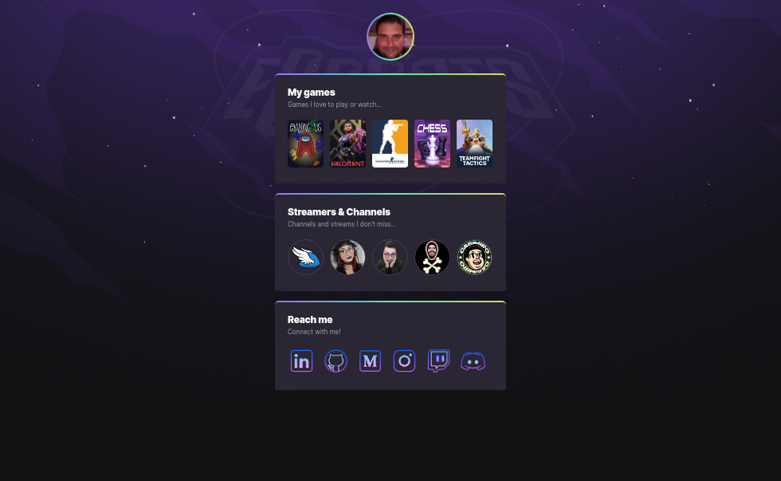

# Next Level Week eSports  

  

This is an online event promoted by Rocketseat, a Brazilian coding school. It's the 10th edition of this hands-on event!  
Trying to reach everyone, it was offered two paths: for beginners, they offered the "Mission: Explorer", and for those who already knows something about development, they offered the "Mission: Ignite".  

## Mission: Explorer  

### Project: Game Hub  

"Mission: Explorer" brought a front-end project which every beginner would be able to create a game hub. Using a style that reminds Linktree, this hub was supposed to show the games the creator likes, the Twitch channels and streamers that he/she likes, and the social medias of the creator.  
The figure below shows an example of the project.  

  

### Techs and tools taught  

  

## Mission: Ignite  

### Project: Find your duo  

"Mission: Ignite" brought a fullstack web and mobile platform that helps gamers find a partner to play their favorite game online, connected to Twitch.  
The figure below shows an example of the project in both versions (landing page of the web app, and home of mobile app).  

    
    

  

### Techs and Tools taught  

  

My path was "Mission: Explorer". I learnt a lot with the educator [@Mayk Brito](https://github.com/maykbrito) and all [Rocketseat's community in Discord!](https://discord.com/channels/327861810768117763/1013907431857868972) So, in this repo, you will find my project developed during this event. You can see a screenshot down below, but you should look it at my [page](https://bryrrea.github.io/nlw-esports-explorer) either!  

Please, let me know what you think about it! Sign in my guestbook and tell me what you think about the project, life, or even to chat. If you want to find me on social media, there are links in my page and in my github profile for it! I want to thanks Rocketseat for this amazing event and opportunity! I hope we can see each other in the future! See ya'! o/  

  
  
 Sign in my guestbook!

